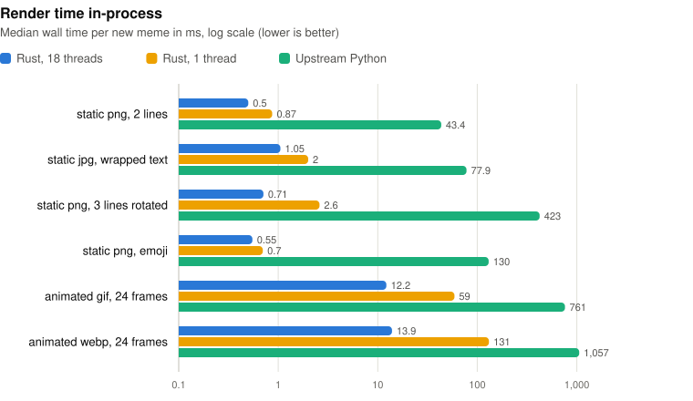
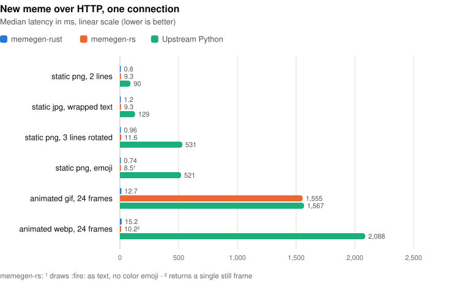
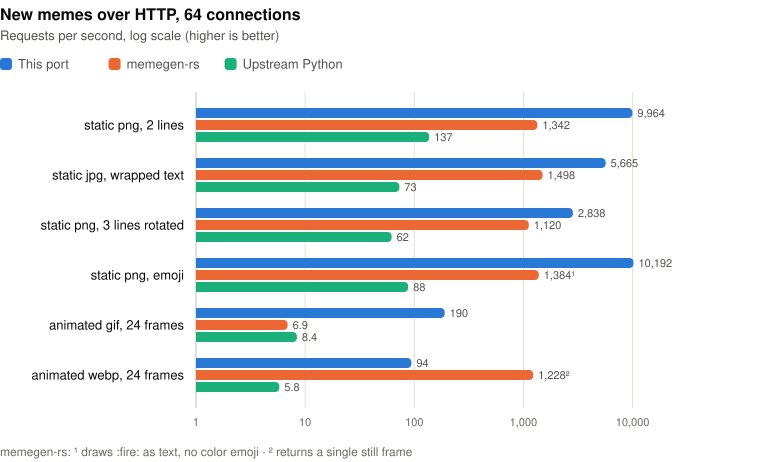

# memegen-rust

A high-performance Rust port of [memegen.link](https://github.com/jacebrowning/memegen), built mainly to run locally as an **MCP server**, with the HTTP API kept as well.

- 568 templates: all 210 upstream ones plus 358 more from [tenequm/memegen-rs](https://github.com/tenequm/memegen-rs) and [imgflip](https://imgflip.com/memetemplates), and upstream's fonts and text layout: auto-wrapping, font fitting, stroke, rotated text and `:emoji:` aliases (drawn with Twemoji)
- Classic meme styling: templates that use upstream's `thick` font (Titillium Web Black) render in Impact instead, and text gets a heavier outline than upstream
- Every template has a description of what it means and what each line is for, plus keywords, so agents can pick the right one; search is ranked and tolerates typos
- PNG, JPG, GIF, WebP and MP4 output, including animated GIF/WebP/MP4 templates
- Animated text: the text boxes are typed out one after another, a character at a time (with eased timing in MP4), then hold the finished meme for 3 seconds before looping, on static and animated templates
- Recently rendered memes are kept in a 256 MB in-memory cache
- A new static PNG meme takes about 0.5 ms; see [Performance](#performance)
- Also runs on [Cloudflare Workers](#cloudflare-workers), with the API and a remote MCP endpoint

## Build

```sh
cargo build --release
```

The binary reads `templates/`, `fonts/`, `emoji/` and `static/` from the repository it was built in. To use a different location, set `--root` or `MEMEGEN_ROOT`.

## MCP

There is no authentication. Two transports are available:

| Transport | Command | Endpoint |
|---|---|---|
| stdio | `memegen mcp` | n/a |
| Streamable HTTP | `memegen serve` | `http://localhost:5000/mcp` |

The HTTP endpoint binds to `127.0.0.1` by default. It rejects requests whose `Host` isn't localhost (to block DNS rebinding) and browser requests with a non-local `Origin`. To allow other host names, pass `--mcp-allowed-host <host>`.

### Claude Code

```sh
# stdio
claude mcp add memegen -- /path/to/memegen-rust/target/release/memegen mcp

# or over HTTP (with `memegen serve` running)
claude mcp add --transport http memegen http://localhost:5000/mcp
```

### Claude Desktop / other clients (stdio)

```json
{
  "mcpServers": {
    "memegen": {
      "command": "/path/to/memegen-rust/target/release/memegen",
      "args": ["mcp"]
    }
  }
}
```

### Tools

| Tool | Description |
|---|---|
| `list_templates` | Templates with their ID, name, description (what it means and what each line is for), line count and example text. With `filter`, a ranked search (word order doesn't matter, typos are tolerated) returning the top 20. Without it, every template, 100 per page. Returns `{templates, total, next_offset}`; pass `next_offset` back as `offset` for the next page (`limit` sets the page size, up to 100). `animated` limits to animated or static templates |
| `get_template` | Full details for one template |
| `list_fonts` | Fonts available for `font` |
| `generate_meme` | Render `template_id` + `text[]`. Optional: `extension`, `font`, `animate_text` (type the text out; defaults `extension` to gif), `save_to` (absolute path), `include_image`. Returns the image inline plus a URL, or over stdio the path of a saved copy (`saved_to`). Inline images over 1 MB (base64) are downscaled in the same format; the URL and saved file stay full size. MP4 isn't returned inline (MCP has no video content) |
| `generate_memes` | Render up to 10 memes in one call: `memes` is a list of `generate_meme` arguments, rendered concurrently. Returns each image and its summary (with `index`) in order, or an `error` for entries that failed. The inline images share the 1 MB limit, so each is downscaled further as the batch grows |

### MCP Apps

`generate_meme` and `generate_memes` link to an [MCP Apps](https://modelcontextprotocol.io/extensions/apps) view (`ui://memegen/meme.html`). In hosts that support MCP Apps, such as Claude, the memes show up in an interactive view instead of only as images in the tool result. From the view, the user can edit a meme's text and re-render it (the view calls `generate_meme` and tells the model about the change), open the full-size URL, download the image (where the host allows it), and, for a batch, pick the one to use, which sends that choice to the chat. Other hosts ignore the view and show the tool result as before.

Over stdio there is usually no server behind `http://localhost` URLs, so `memegen mcp` saves every meme to a cache directory (`~/Library/Caches/memegen` on macOS, `$XDG_CACHE_HOME/memegen` or `~/.cache/memegen` on Linux) and returns that path instead. Files are named `{date}_{time}_{template}-{hash}.{ext}` in local time (e.g. `2026-10-09_143012_fry-0123456789abcdef.png`), so they sort by when they were made. Repeating a request returns the file already saved for it, whatever its date. Set `--output-dir` or `MEMEGEN_OUTPUT_DIR` to change it. Saved memes older than a week are deleted while the server runs; other files in the directory are left alone. The URL is still returned when `DOMAIN` is set.

## HTTP API

Start the server with `memegen serve` (or just `memegen`). `/` is a landing page with a meme playground, MCP setup snippets and the template gallery (live at [memegen.dev](https://memegen.dev)). API docs ([Scalar](https://scalar.com)) are at `/docs` and the OpenAPI spec at `/openapi.json`.

| Route | Description |
|---|---|
| `GET /images/{template}/{line1}/{line2}.{png,jpg,gif,webp,mp4}` | Render a meme. `?font=` sets the font; `?animate_text=true` types the text out (gif/webp/mp4 only, see [Animated text](#animated-text)); non-canonical text redirects with a 301 |
| `GET /images/{template}.{ext}` | Template background without text |
| `GET /images/` | Example memes (`?filter=`, `?animated=`) |
| `POST /images/` | Build a meme URL from `{template_id, text[], font, extension, animate_text, redirect}` (JSON or form) |
| `GET /templates/`, `GET /templates/{id}` | Template catalog (`?filter=` for a ranked search, `?animated=`) |
| `POST /templates/{id}` | Build a meme URL for a template |
| `GET /fonts/`, `GET /fonts/{id}` | Fonts |

Text escapes in URLs: `_` → space, `__` → `_`, `--` → `-`, `~q` → `?`, `~a` → `&`, `~p` → `%`, `~h` → `#`, `~s` → `/`, `~b` → `\`, `~l` → `<`, `~g` → `>`, `~n` → newline, `''` → `"`.

### Animated text

With `animate_text`, the text boxes are typed out in order, one mark at a time (letters and emoji; spaces don't take a step), with a 0.6 s pause between boxes, then the finished meme holds for 3 seconds before it loops. The layout is the finished meme's, so text doesn't shift as it appears. Each box takes 60 ms per mark on average. Text boxes' `start`/`stop` timing is ignored.

- **GIF and WebP**: every mark takes 60 ms. On an animated template the text types over the template's frames, several marks per frame if they're slow. Long text types several marks per frame to stay within 60 typing frames (24 on Workers).
- **MP4**: the timing is eased in and out (an inverse ease-in-out sine). Each box starts slowly, speeds up to about 40 ms per mark in the middle, and slows down again for the last marks. On an animated template the text is drawn at up to 30 fps between the template's frames, which video compresses well.

On an animated template the background keeps playing through the pauses and the hold.

### MP4

`.mp4` renders the same frames and timing as `.gif` (except that [animated text](#animated-text) has eased timing), as H.264 video, and is much smaller: `oprah` is 262 KB instead of 1.7 MB, and `fry` with animated text 128 KB instead of 2.8 MB. It's encoded with [rusty_h264](https://crates.io/crates/rusty_h264-encoder), a pure-Rust encoder, so it's the same on Workers. A video doesn't loop by itself and has no transparency, so embed it with `<video autoplay loop muted playsinline>`. An odd width or height loses its last pixel column or row (4:2:0 chroma needs even dimensions). Encoding is single-threaded, so an MP4 takes longer to render than a GIF (see [Performance](#performance)).

## Configuration

| Variable / flag | Default | Purpose |
|---|---|---|
| `HOST` / `--host` | `127.0.0.1` | Bind address |
| `PORT` / `--port` | `5000` | Port |
| `DOMAIN` | unset | When set, API responses use `https://$DOMAIN` URLs |
| `DEBUG=true` | off | Skip the render cache and re-render every request |
| `DEFAULT_STATIC_EXTENSION` | `png` | Default format for static templates |
| `DEFAULT_ANIMATED_EXTENSION` | `gif` | Default format for animated templates |
| `MEMEGEN_ROOT` / `--root` | build directory | Location of the assets |
| `MEMEGEN_OUTPUT_DIR` / `--output-dir` | user cache directory | Where `memegen mcp` saves memes |
| `RUST_LOG` | `info` (`warn` for stdio) | Log level (logs go to stderr) |

## Cloudflare Workers

`worker/` builds the same code to WebAssembly with [workers-rs](https://github.com/cloudflare/workers-rs). It serves the full HTTP API plus MCP at `/mcp` (stateless Streamable HTTP, JSON responses, no sessions).

```sh
cd worker
npx wrangler dev      # http://localhost:8787
npx wrangler deploy   # https://memegen.<account>.workers.dev
```

Wrangler builds with `worker/build.sh`, which adds the `wasm32-unknown-unknown` Rust target and installs `worker-build`. If `cargo` isn't on the `PATH` (as in Cloudflare's Workers Builds), it installs Rust with rustup first. In Workers Builds it keeps the toolchain, `worker-build` and the target directory under `~/.npm`, which the [build cache](https://developers.cloudflare.com/workers/ci-cd/builds/build-caching/) saves between builds (`worker/package.json` exists only so the cache detects npm).

- **Assets**: `templates/`, `fonts/`, `emoji/` and `static/` (about 4,700 files, 105 MB) are uploaded as [static assets](https://developers.cloudflare.com/workers/static-assets/) through symlinks in `worker/assets/`; later deploys only upload changed files. The Worker runs first for every request (`run_worker_first`), so the raw files aren't public. The compiled Worker is about 2 MB gzipped.
- **Startup**: the template catalog is embedded at build time; fonts (5 MB) are fetched on the first request in each isolate.
- **Caching**: successful `/images/...` responses go into Cloudflare's cache, so a repeated meme isn't rendered again. The Cache API has no effect on `*.workers.dev`, so use a [custom domain](https://developers.cloudflare.com/workers/configuration/routing/custom-domains/) to get this. Each isolate also keeps small in-memory caches (isolates have 128 MB of memory).
- **CPU time**: rendering needs the Workers Paid plan. In local `wrangler dev`, a new static meme took 8–17 ms, an animated GIF about 85 ms and an animated MP4 a few hundred ms, so most renders exceed the Free plan's 10 ms CPU limit. `wrangler.toml` sets a 30 s limit.
- **Differences from the native server**: WebP is lossless, because libwebp (C) doesn't build for `wasm32-unknown-unknown`. Animated WebP keeps 20 frames instead of 80 and is large (about 5.6 MB for `oprah`), so use GIF for animations. `generate_meme` has no `save_to`. The `/mcp` endpoint has no Host/Origin checks; it's meant to be public. Set `DOMAIN` in `wrangler.toml` to use a custom host in returned URLs (by default, URLs use the host of the first request each isolate serves).

### Remote MCP

```sh
claude mcp add --transport http memegen https://memegen.<account>.workers.dev/mcp
```

## Not ported

Watermarks, previews, error images, custom backgrounds and overlays, size/color/layout parameters, upstream's per-line animated text timing (`start`/`stop`; this port's `animate_text` is a different, typewriter effect), legacy shortcut redirects, and the remote API-key/analytics integrations.

## Performance

Run `memegen bench` to reproduce (set `RAYON_NUM_THREADS=1` for single-core numbers). These are medians on an 18-core Apple M5 Pro. "Warm" means the template background is already decoded but the meme itself is new; this is the normal case in a running server. Static PNG and JPG renders reuse each template's encoded background and only encode the rows the text touches. Animated WebP frames are encoded in parallel, each as just the area that changed since the previous frame.

<picture>
  <source media="(prefers-color-scheme: dark)" srcset="docs/bench-render-dark.svg">
  
</picture>

| Case | Upstream Python wall / CPU | Rust warm wall / CPU (1 thread) | Rust warm wall (18 threads) |
|---|---|---|---|
| static png, 2 lines | 43.4 / 43.3 ms | 0.87 / 0.88 ms | 0.50 ms |
| static jpg, wrapped text | 77.9 / 77.9 ms | 2.0 / 2.0 ms | 1.05 ms |
| static png, 3 lines rotated | 423 / 422 ms | 2.6 / 2.7 ms | 0.71 ms |
| static png, emoji | 130 / 47 ms (Twemoji download) | 0.70 / 0.70 ms | 0.55 ms |
| animated gif, 24 frames | 761 / 759 ms | 59 / 59 ms | 12.2 ms |
| animated webp, 24 frames | 1,057 / 1,053 ms | 131 / 131 ms | 13.9 ms |

Animated MP4 (not in upstream, so not in the table) takes 48 ms warm on 1 thread and 40 ms on 18, for a 63 KB file instead of the GIF's 1.4 MB: the H.264 encoder is single-threaded, so only the frame rendering runs in parallel.

A repeated meme comes from the in-memory cache in about 1 µs. Starting `memegen mcp` takes about 13 ms to the `initialize` response.

### Over HTTP

`memegen bench --url <base URL>` load-tests any running memegen-compatible server: this one, upstream memegen, or [memegen-rs](https://github.com/tenequm/memegen-rs). Each connection sends requests back to back for 5 seconds per case, and every request is a new meme, so no server cache is hit. Below, the three servers ran on the same machine, one at a time: memegen-rust (`memegen serve`), memegen-rs at `852bd13` with no render cache, and upstream under gunicorn with 18 uvicorn workers.

One connection, median latency:

<picture>
  <source media="(prefers-color-scheme: dark)" srcset="docs/bench-latency-dark.svg">
  
</picture>

| Case | memegen-rust | memegen-rs | Upstream Python |
|---|---|---|---|
| static png, 2 lines | 0.80 ms | 9.3 ms | 90 ms |
| static jpg, wrapped text | 1.2 ms | 9.3 ms | 129 ms |
| static png, 3 lines rotated | 0.96 ms | 11.6 ms | 531 ms |
| static png, emoji | 0.74 ms | 8.5 ms¹ | 521 ms |
| animated gif, 24 frames | 12.7 ms | 1,555 ms | 1,567 ms |
| animated webp, 24 frames | 15.2 ms | 10.2 ms² | 2,088 ms |

64 connections, requests/s (p99 latency):

<picture>
  <source media="(prefers-color-scheme: dark)" srcset="docs/bench-throughput-dark.svg">
  
</picture>

| Case | memegen-rust | memegen-rs | Upstream Python |
|---|---|---|---|
| static png, 2 lines | 9,964 (9.5 ms) | 1,342 (65 ms) | 137 (767 ms) |
| static jpg, wrapped text | 5,665 (18 ms) | 1,498 (53 ms) | 73 (1,529 ms) |
| static png, 3 lines rotated | 2,838 (68 ms) | 1,120 (75 ms) | 62 (3,390 ms) |
| static png, emoji | 10,192 (9.0 ms) | 1,384 (68 ms) | 88 (1,322 ms) |
| animated gif, 24 frames | 190 (666 ms) | 6.9 (9,866 ms) | 8.4 (7,605 ms) |
| animated webp, 24 frames | 94 (1,853 ms) | 1,228 (65 ms)² | 5.8 (10,965 ms) |

The charts are drawn by `python3 docs/charts.py` from the numbers in these tables. memegen-rs renders at the template's own size, so it draws fewer pixels: `fry` comes out at 603×452 rather than 800×600, and the GIF at 498×361 rather than 600×434. ¹ memegen-rs has no color emoji and draws `:fire:` as text. ² memegen-rs has no animated WebP and returns a single still frame.

With 64 connections requesting the same meme, `wrk` measured about 17,000 cached responses/s.

## Licenses

The code and templates come from memegen (MIT, see `LICENSE-upstream.txt`); templates not in upstream come from tenequm/memegen-rs (MIT, see `LICENSE-tenequm.txt`); fonts carry their own licenses in `fonts/`. Emoji graphics are Twemoji (CC-BY 4.0, see `emoji/LICENSE.md`).
